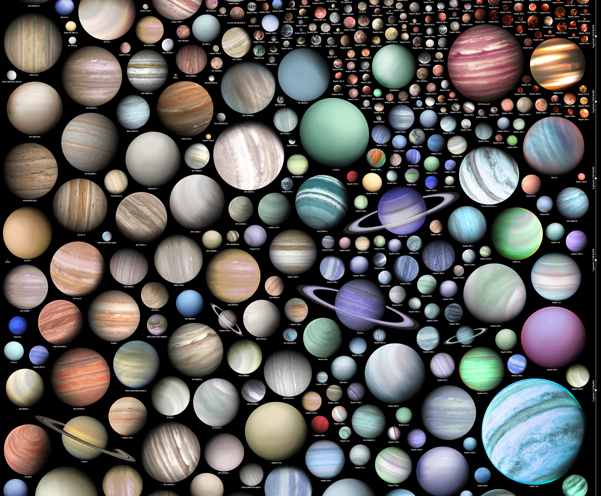

# Stella Nova - NASA Space Apps Challenge 2024
Welcome to **Stella Nova!** This repository contains a functional Figma prototype for an exciting educational game developed for the NASA Space Challenge 2024. Stella Nova takes players on an interstellar adventure where they discover Earth-like exoplanets while tackling the challenges of an uncertain future.

This prototype provides an initial look into the game's mechanics and storyline, offering a glimpse into this captivating space expedition.

    

# ABOUT THE CHALLENGE
### Chronicles of Exoplanet Exploration

Embark on a thrilling journey to revolutionize exoplanet education! The discovery of exoplanets has redefined our understanding of planetary systems, expanding what we know about our place in the universe. From scorching gas giants to potentially habitable rocky worlds, these distant worlds offer a glimpse into the remarkable diversity of planetary configurations. Traditional educational materials about this topic may not be accessible to everyone, particularly those from underserved communities or with limited access to resources. Your challenge is to develop engaging and accessible learning materials that leverage creativity to enlighten students about the wonders of exoplanets.

    

# WHAT EXACTLY DOES IT DO? HOW DOES IT WORK?
No se

# WHAT BENEFITS DOES IT HAVE? WHAT DO YOU HOPE TO ACHIEVE?
The objectives of the project are to create innovative and creative solutions that enable students to visualize and learn about exoplanets in an accessible and engaging way. The project aims to transform complex scientific concepts into interactive educational tools by leveraging technologies such as virtual reality, dynamic visualizations, and data science. The goal is to inspire curiosity and learning, fostering a deeper understanding and appreciation of the diversity of exoplanets and their significance in the universe.

## ARTIFICIAL INTELLIGENCE
- Image generation:
    - Haiper
    - ChatGPT
    - LTX
    - Meta IA

- Voice generation:
    - aa

## RESOURCES:
- 

## FIGMA

 
  

## Members
- Mariu Andrade
- Isabella Martín
- Alexandre Icaza
- Nahin Cevallos
- Raúl Laurido
- Jose Luis Chong

